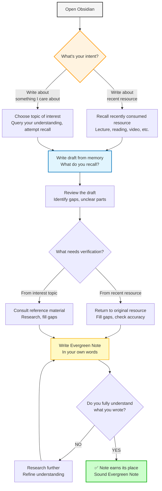

---
tags:
  - template
---

```mermaid

graph TD
    Start[Open Obsidian] --> Choice{What's your intent?}
    
    Choice -->|Write about<br/>recent resource| BranchA[Recall recently consumed resource<br/>Lecture, reading, video, etc.]
    Choice -->|Write about<br/>something I care about| BranchB[Choose topic of interest<br/>Query your understanding, attempt recall]
    
    BranchA --> Draft[Write draft from memory<br/>What do you recall?]
    BranchB --> Draft
    
    Draft --> Review[Review the draft<br/>Identify gaps, unclear parts]
    
    Review --> Verify{What needs verification?}
    
    Verify -->|From recent resource| SourceA[Return to original resource<br/>Fill gaps, check accuracy]
    Verify -->|From interest topic| SourceB[Consult reference material<br/>Research, fill gaps]
    
    SourceA --> Evergreen[Write Evergreen Note<br/>In your own words]
    SourceB --> Evergreen
    
    Evergreen --> Understand{Do you fully understand<br/>what you wrote?}
    
    Understand -->|NO| Research[Research further<br/>Refine understanding]
    Research --> Evergreen
    
    Understand -->|YES| Complete[✅ Note earns its place<br/>Sound Evergreen Note]
    
    style Start fill:#f5f5f5,stroke:#333,stroke-width:2px
    style Choice fill:#fff3e0,stroke:#ff9800,stroke-width:2px
    style Draft fill:#e1f5fe,stroke:#0277bd,stroke-width:2px
    style Evergreen fill:#fff9c4,stroke:#fbc02d,stroke-width:2px
    style Complete fill:#ccffcc,stroke:#00aa00,stroke-width:2px
```

